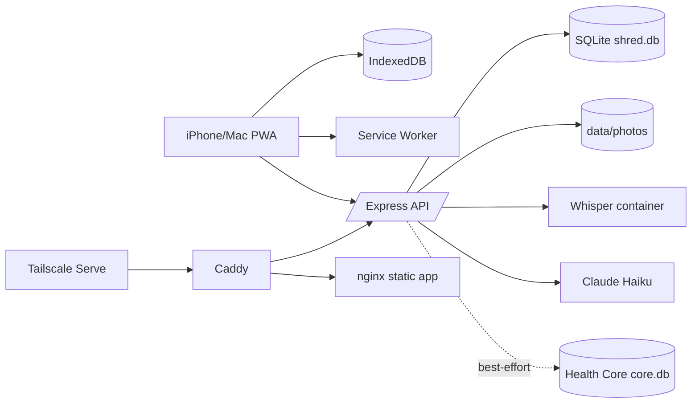
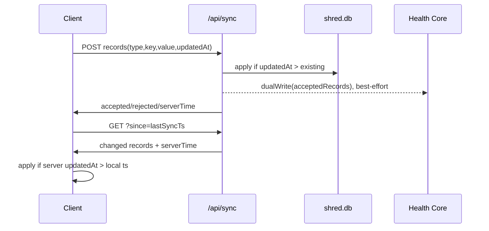
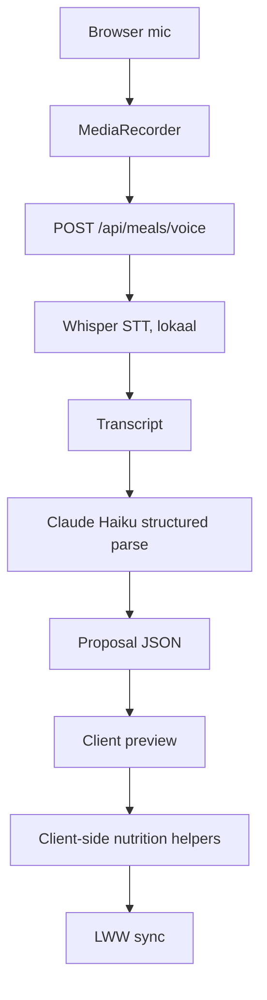

# System Architecture

## Overzicht

Shred is een offline-first PWA met een kleine sync-backend. De browser mag zonder netwerk doorwerken. De backend is de sync anchor tussen iPhone en Mac en schrijft geaccepteerde aggregates best-effort naar Health Core.

## Frontend Architectuur

De frontend is vanilla ES modules:

- `js/app.js` bootstrapt state, nutrition, foto's, UI, sync en service worker.
- `js/state.js` beheert de in-memory state en IndexedDB snapshot.
- UI-tabmodules renderen direct vanuit `state`.
- Mutaties gaan via domeinhelpers en roepen `mutate(type, key)` aan.
- `state.ts[type][key] = updatedAt` is de basis voor outbound sync.

De UI mag geen eigen parallelle bron van waarheid maken. Renderfuncties mogen tijdelijk DOM-state gebruiken, maar blijvende data hoort in `state`.

## Backend Architectuur

Express draait als `shred-api` container en exposeert:

- `GET /api/health`
- `GET /api/health/core` — dual-write status + actieve formuleversies (observability, #127)
- `GET/POST /api/sync`
- `GET/POST/DELETE /api/photos`
- `POST /api/meals/voice`
- `POST /api/products/lookup`

SQLite draait in WAL mode via `better-sqlite3`. Tabellen zijn recordtype-georiënteerd: `meta`, `day_log`, `sets`, `exercise_notes`, `weights`, `foods`, `products`, `meal_templates`, `slot_choices`, `measurements`, `photos`.

## Sync Architectuur

Sync is Last-Write-Wins per logisch record:

Server wint ties. Foto's synchroniseren als metadata-records; blobs worden apart via `/api/photos/:id` gehaald en lokaal in IndexedDB opgeslagen.

## Offline-First Strategie

- App shell wordt gecachet.
- API-calls zijn network-first/no-cache.
- Lokale mutaties werken offline en worden later gesynct.
- Voice-opnames worden offline in IndexedDB `queue` bewaard.
- Foto's worden lokaal als Blob opgeslagen en later geupload.
- UI moet bruikbaar blijven als `/api/health` faalt.

## Service Worker

`service-worker.js` gebruikt:

- `CACHE_VERSION` als deploy gate.
- Shell cache voor HTML/CSS/JS/icons.
- Photo cache voor `/api/photos/:id`.
- API pass-through met offline `503` response.

Regel: elke wijziging aan app shell assets vereist een `CACHE_VERSION` bump. Zie [19_CLAUDE_CODE_GUIDELINES.md](19_CLAUDE_CODE_GUIDELINES.md).

## Auth-Grens

Shred heeft **geen applicatie-auth**. De vertrouwensgrens is volledig Tailscale (WireGuard + ACL): alleen apparaten in Peter's tailnet bereiken frodo. Binnen het tailnet is alle data onge-authenticeerd lees/schrijfbaar — dat is een bewuste keuze voor een single-user, self-hosted opzet.

De bijbehorende Docker-poortgrens is een harde invariant:

- alleen `shred-caddy` (:80) en de statische `shred` nginx (:8088 fallback) hebben een host-poort;
- `shred-api` en `shred-whisper` hebben **geen** host-poort en zijn alleen via het interne docker-net / Caddy bereikbaar.

`api/check-auth-boundary.sh` verifieert deze grens (faalt als de API/Whisper toch een host-poort krijgen). TLS wordt bovenstrooms door Tailscale Serve getermineerd; Caddy spreekt plain-http op :80.

**Nooit** frodo op LAN/internet openen (geen Tailscale Funnel, geen port-forward op 80/443) en de tailnet-ACL niet verbreden naar untrusted devices. Een bearer-token-laag terugzetten kan via de (uitgecommentarieerde) middleware in `api/server.js` + `BEARER_TOKEN` in `.env`.

## Voice Pipeline

Audio blijft op frodo/LAN. Alleen transcripttekst en compacte productbibliotheek gaan naar Claude.

## AI Integraties

Huidig:

- Voice meal parsing.
- Product macro lookup.

Gepland:

- Weekreviews.
- Traininganalyse.
- Nutrition compliance analyse.
- Recovery/readiness analyse.
- Prognoses en experimentinterpretatie.

AI-integraties moeten structured output gebruiken, sanity-checks toepassen en Peter correctie laten doen.

