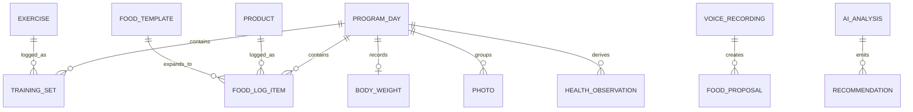

# Domain Model

## Domeinen

Shred bestaat uit zeven kern-domeinen:

- Training
- Nutrition
- Body Composition
- Recovery
- Health Core
- Voice
- AI

## Globaal Model

## Training

Entiteiten:

- Programma: 90-dagen recompositie.
- Program Day: dag 1-90, berekend vanaf `startDate`.
- Session: K1, K3, K5, CI, CZ, R.
- Slot: positie-stabiele oefenplek met categorie en default exercise.
- Exercise: concrete oefening met `id`, naam, categorie, knieflag en notes.
- SlotChoice: per dag gekozen oefening.
- SlotDefault: onthouden voorkeur per slot.
- Set: gewicht, reps, RIR.
- ExerciseNote: notitie per oefening/dag.
- PR: afgeleide status uit historie.

Verantwoordelijkheid: trainingsuitvoering, progressie, volume, oefeningvarianten, knie-aware swaps en deloadsignalen.

## Nutrition

Entiteiten:

- Product: macro's per 100g, optionele unit, favorite/use stats, hidden/deleted.
- FoodLogDay: maaltijden per programmadag.
- FoodLogItem: productId, grams, addedAt.
- MealTemplate: herbruikbare set items.
- MacroGoal: kcal, protein, carbs, fat.
- ComplianceScore: afgeleid uit calorie- en eiwitdoelen.

Verantwoordelijkheid: snel loggen, macroberekening, productbibliotheek, templates, AI lookup en voice proposals.

## Body Composition

Entiteiten:

- BodyWeight: kg per programmadag.
- TrendWeight: afgeleid 7/14-daags gemiddelde of regressie.
- Photo: week, blob metadata, deleted flag.
- Measurement: toekomstig waist/hip/chest/arm.
- RecompositionAssessment: afgeleid uit gewicht, foto's, training en voeding.

Verantwoordelijkheid: vetverlies en recompositie objectiveren zonder te veel ruis op dagbasis.

## Recovery

Entiteiten:

- SleepObservation: slaapduur/kwaliteit uit Apple Health/Health Core.
- HRVObservation: HRV SDNN.
- RestingHeartRateObservation.
- FatigueSignal: subjectief of afgeleid.
- ReadinessScore: samengestelde score.
- DeloadSignal: training/recovery/nutrition/body signalen samen.

Verantwoordelijkheid: bepalen of de geplande prikkel past bij herstelcapaciteit.

## Health Core

Entiteiten:

- Source.
- MetricType.
- Observation.
- DerivedMetric.
- Experiment.
- Correlation.
- Prediction.

Verantwoordelijkheid: centrale health time-series, additive ingest, correlaties, experimenten en lange termijn intelligence.

## Voice

Entiteiten:

- VoiceRecording: tijdelijk audio object.
- Transcript: tekst uit Whisper.
- FoodProposal: parse-resultaat met items en warnings.
- PendingVoiceProposal: offline of wachtend op bevestiging.

Verantwoordelijkheid: voeding loggen met zo min mogelijk frictie, zonder automatische oncontroleerbare writes.

## AI

Entiteiten:

- AnalysisRequest.
- AnalysisResult.
- Recommendation.
- Confidence.
- EvidenceReference.

Verantwoordelijkheid: interpretatie, samenvatting en aanbeveling. AI schrijft alleen door wanneer de workflow dat veilig maakt.

