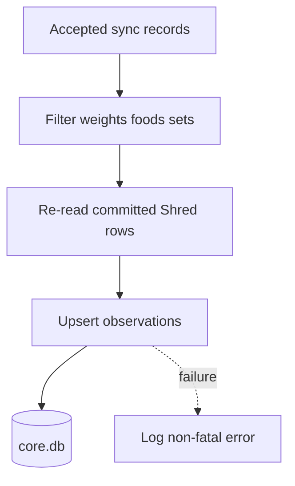

# Health Core Integration

## Rol

Health Core is de centrale health datastore. Shred blijft de bron voor fitnessworkflow en granulariteit; Health Core ontvangt observations en levert op termijn intelligence terug.

## Observations

Huidige Shred dual-write schrijft:

- `body.weight` uit `weights`.
- `nutrition.calories` uit dagaggregatie van foods.
- `nutrition.protein`.
- `nutrition.carbs`.
- `nutrition.fat`.
- `fitness.session_volume` uit sets per dag.

Elke observation heeft:

- `metric_type`
- `value`
- `unit`
- `timestamp`
- `source = shred`
- `external_id`
- `source_updated_at`
- `metadata`

## Derived Metrics

Nutrition en session volume zijn Shred-derived aggregates omdat de inputs in `shred.db` leven.

Metadata bevat formuleversies:

- `nutrition_day_v1`
- `session_volume_day_v1`

Deze versies zijn opvraagbaar via `GET /api/health/core` (`coreStatus()` in `api/core.js`), samen met of de dual-write aanstaat en welke metric-keys geschreven worden — handig om vanaf het andere device te checken zonder in de DB te kijken. De endpoint bevat geen secrets.

Regel: wanneer formules veranderen, verhoog `formula_version`, houd `api/core.js` gelijk aan `health-core/scripts/lib/aggregate.mjs`, en documenteer impact. `api/test-core.mjs` borgt dat live-write dezelfde aggregaten produceert (zie [19_CLAUDE_CODE_GUIDELINES.md](19_CLAUDE_CODE_GUIDELINES.md)).

## Dual Write

Dual-write gebeurt in `api/core.js` na een succesvolle sync-commit.

Eigenschappen:

- additive;
- best-effort;
- mag Shred-sync nooit blokkeren;
- no-op als `CORE_DB` ontbreekt;
- LWW op `source_updated_at`;
- idempotent via `UNIQUE(source, external_id, metric_type)`.

## Sync Strategie

Shred sync blijft primair. Health Core is geen blocking dependency.

Toekomstige read-integratie:

- Shred vraagt Health Core summaries voor recovery/Apple Health.
- Als Health Core offline is, toont Shred laatste lokale data of "niet beschikbaar".
- Geen workflow mag stuklopen door Health Core unavailability.

## Experiment Tracking

Health Core moet experimenten ondersteunen zoals:

- calorie target adjustment;
- deload week;
- zone 2 frequency;
- sleep intervention;
- knee-friendly exercise substitution.

Experimenten hebben:

- hypothese;
- start/einddatum;
- metrics;
- baseline;
- outcome;
- confidence;
- notes.

## Correlaties

Belangrijke correlaties:

- slaap/HRV versus trainingperformance;
- calorie deficit versus weight trend;
- carbs versus session volume;
- steps versus fat loss;
- deload versus performance rebound;
- knie-notities versus oefeningcategorieën.

Correlaties zijn hypothesis generators, geen causale claims.

